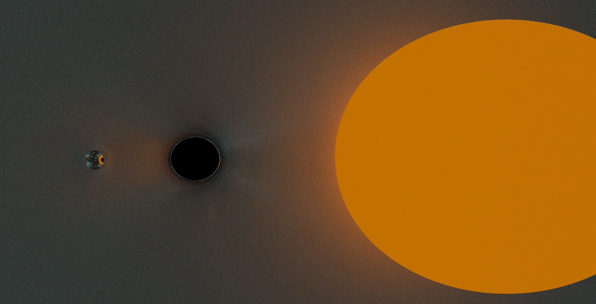

# vulkan-nonlinear-raytracing
<br>
A real-time non-linear ray tracing engine made using mainly Vulkan Compute and C++.<br>
**Note**: This README contains a lot of animations which take a long time to load.

## Features / gallery
### Visualizing black holes
<br>
Visualize light traveling through non-linear media such as the curved space near a black hole.

### Ray tracing in a new light
<br>
Make use of the many benefits of ray tracing such as realistic reflections and lighting in new and interesting scenarios.

### Gravitational lensing
<br>
Notice the bright area between the black hole and mirror sphere on the left side of the image above? Sort of looks like an "opposite shadow". This is the effect of the black hole's gravitational well bending light towards the ground beneath it.

### Take a dive
<br>
Take a dive into a black hole, peering at the universe through the sliver of light able to reach you. The animation above shows what it would look like to orbit a black hole at close distance while looking away from it.

## Setup
### Download Vulkan SDK
Go to [LunarXchange](https://vulkan.lunarg.com) to download the version of Vulkan SDK appropriate for your system.

### Clone repository and fetch external dependencies
```sh
$ git clone https://github.com/Thefantasticbagle/vulkan-compute.git
$ cd vulkan-compute
$ git submodule init
$ git submodule update
```

### Build the project
For this step, cmake is required.
```sh
$ mkdir build
$ cd build
$ cmake -S ../ -B ./
```
Lastly, use Visual Studio to open `vulkan-compute.sln`, and build for Release! You may have to set vulkan-compute as "Startup project".
(Building for Debug enables Validation layers and lowers performance)
